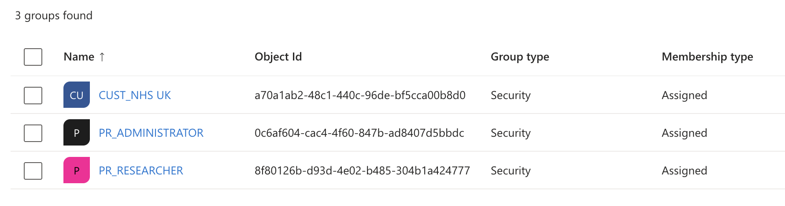
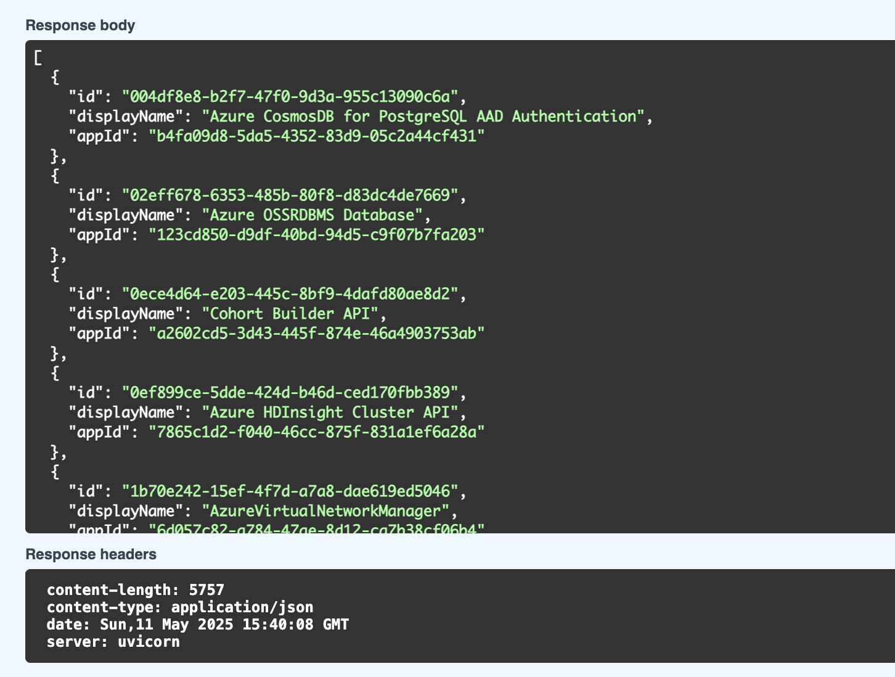

# User Service Spike 

## Purpose

This repo explores how to model and manage **"platform roles"** for services using only Microsoft Entra ID (Azure AD), without needing a custom role store.

We aim to use Azure-native constructs to manage:

- **Service Roles**: App-level permissions, defined via **App Roles** in App Registrations
- **Platform Roles**: Logical roles across services.  For example, "Platform Administrator" may map to several App Roles.  
- **Customer organizations**: Using groups (potentially dynamic groups) to group users by customer organization

The User Service is a FastAPI application which provides APIs for managing all of this. 

----- 

## Requirements & Dependencies 

The app must be registered in Entra ID with **admin consent granted**, and include the following **application permissions** for Microsoft Graph:

| Permission | Purpose                            |
|------------|------------------------------------|
| `Group.ReadWrite.All` | Create/update/delete Entra groups  |
| `Directory.ReadWrite.All` | Add/remove users to/from groups    |
| `AppRoleAssignment.ReadWrite.All` | Assign service App Roles to groups |

These must be granted as Application (not Delegated) permissions.


**Azure CLI Setup Example**

Note that you must have sufficient (admin) rights in the Azure tenant. 

Create the app registration: 

```bash
az ad app create \
  --display-name "User Service" \
  --required-resource-accesses @graph-permissions.json 
```

Note the 'appId' output from the above then use it to grant admin consent: 

```bash 
az ad app permission admin-consent --id <app-id>
```

The `graph-permissions.json` is provided in this repo.  If you're interested where these values came from, see 'further reading' below.  

## Installation and Setup 

You need Poetry & Python 3.12+

```bash 
# Install dependencies - this should create a virtualenv in a local .venv directory.
poetry install

# Create a .env file
cp .env.example .env
# Add AZURE_CLIENT_ID, CLIENT_SECRET, TENANT_ID etc.

# Run the app
poetry run uvicorn user_service.main:app --reload
```

View the API at http://127.0.0.1:8000/docs

-----

## Takeaways 

1. This spike proves that it **is** possible to model and manage **"platform roles"** for services using only Microsoft Entra ID (Azure AD).


2. It is also possible to use use Groups for 'Customers' (companies/organizations to which users belong). 


3. There are [limitations](docs/3-limitations.md) associated with Graph & Entra API limits but they should not limit us given expected traffic load & usage. 


4. There are also limtiations in the number of Groups per tenant but it is the TRE Workspaces which will impact that more than Platform Roles. 


-----

## To discuss further and decide 

### Naming convention

How will you identify Platform Roles vs. Customers ? 



### Should Service Roles really be queried realtime?

The `/services` endpoint in this repo currently returns all service principals, including Microsoft-managed ones, internal APIs, and infrastructure services, which is not desirable. 



This creates several problems: 

- **Performance**: it can take over a minute to get a response. 
- **Security**: it could lead to overexposure - some service principals may be sensitive. 
- **Scalability**: large tenants may have thousands of SPs; this will slow down or hang the API

Options to solve this: 

- Provide the allowed Service Roles to the FastAPI as configuration (since it's read-only anyway). 

OR 

- Query real-time with explicit name filters; and use caching. 

-----

## Further Reading  

1. [Use case & comparison with other approaches](docs/1-context-and-adr.md)
2. [Role composition and group naming strategy](docs/2-role-composition-and-group-naming-strategy.md)
3. [Limitations](docs/3-limitations.md)
4. [Microsoft Graph API Guids](docs/4-microsoft-graph-api-guids.md)
5. [Script to create Service Roles](docs/5-az-cli-create-service-roles.md)

---

## To complete or explore further: 

- Can Dynamic Groups be used for Customers - i.e. can we rely on customers all belonging to the same email domain ? 
- Retries on Graph API calls with expontential backoff. 
- Unit tests and mock Graph server
- Caching of Service Roles
